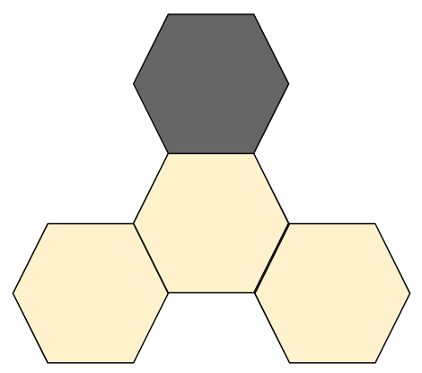

# Hive Board Game AI Documentation

William Reames

This document gives an overview regarding how I implemented Hive within Python and explains how I implemented my AI.

## Implementing Hive

### Keeping Track of the Board

The first challenge I came across was determining a way to implement the hexagon-based game board within Python. The solution I ended up implementing was to give each hexagon a coordinate, and store it as if it were on a regular 2D plane. 

This image shows how each hexagon can be given a specific coordinate on a plane:

This image shows how each Piece would be stored within my Python implementation. In this case, the Piece would be located at (0, 0), and the displayed coordinates surrounding it would be the six sides of that piece:

Furthermore, I also implemented both Pieces and EmptySpaces. The EmptySpaces were extremely important in simplifying my implementation. EmptySpaces allowed me to more easily understand where players could place new Pieces along with knowing where Pieces could be moved.

As for storing this information, I stored each space object into a dictionary that related the coordinate of the space to the object at that location. This was also separated into two dictionaries: one for Pieces, and one for EmptySpaces. This allowed easy access to a space object if its location is already known. For example, each space contains sets of the surrounding Pieces and surrounding EmptySpaces. This way each space has easy access to all of its surrounding locations. This diagram helps display the class structure used to implement the game:

### Performing Actions on the Game Board

There are two different actions a player can perform on a given turn: placing pieces or moving pieces. To implement this, each Piece was given two important functions: `set_location_to(new_location)` and `remove()`. In order to place a Piece, a new Piece object would be created, then its `set_location_to(new_location)` function would be called. Moreover, if a player would like to move a piece, the Piece would call its `remove()` function, followed by its `set_location_to(new_location)` function. 

To determine where a player could place new Pieces, each EmptySpace on the board would keep track of the number of connected white Pieces and the number of connected black Pieces. Therefore, if an EmptySpace was only connected to white Pieces, white could place a new Piece there. On the other hand, if an EmptySpace was only connected to black pieces, black could place a new Piece there.

As for determining where Pieces could be moved, each Piece had its own `calc_possible_moves()` function, which could be called to updated its set of possible moves listed within the HiveGameBoard. This function was implemented within each of the Piece subclasses.

### Universal Movement Rules

There are two movement rules within Hive that apply to all Pieces on the board: freedom of movement and the "one hive" rule. 

#### Freedom of Movement

The freedom of movement rule states that pieces must slide on the board rather than be picked up off of it (although this does not apply to Grasshoppers or Beetles since they jump on or hop over Pieces). The following images help demonstrate this rule:

To implement this, I kept track of certain "sliding rules". Whenever a Piece was set to a new location (whether by being placed as a new piece or by moving to that location), it would check if other Pieces exist in certain locations. If it found a Piece at any of these locations, the spaces in between the two Pieces would be marked as unable to slide to each other. Then, if either of these Pieces are removed later in the game, the two spaces between them are updated so that they are marked as being able to slide to each other again. The sequence of images below help show how this works. Note, though, that these images are meant to demonstrate this rule specifically, and do not display all the Pieces or EmptySpaces that would usually be found on a game board:

1: A subset of a board state containing two Pieces and one EmptySpace

2: A new Piece is placed

3: The new Piece finds another Piece in one of the specified locations

4: The two spaces between those Pieces are marked as not being able to slide to each other

5: A Piece that was preventing sliding between two pieces was removed

6: The two spaces between those Pieces are marked as being able to slide to each other again

#### The "One Hive" Rule

The "one hive" rule states that all Pieces must be connected to each other at all times. For example, in the below image, the black Ant is unable to move, since doing so would split the hive into two separate groups:

To implement this, each Piece contained a `can_move` boolean value. If this rule would prevent a Piece from moving, this value was set to False. Otherwise, the `can_move` value would be set to True.

There were two methods that I used to determine whether a Piece could move. For starters, if a Piece (a) was placed with only one connection to another Piece (b), the connected Piece (b) would be locked based on this rule. This is because the connected Piece (b) is the only connection the new Piece (a) has to the rest of the Hive. However, the inverse of this rule is not true. For example, the black Piece in the image below is only connected to one Piece. If the black piece were removed, the Piece it was connected to would still need to be locked based on the "one hive" rule.

Beyond the one simplification of locking Pieces if a new piece is placed with one connected Piece, the rest of the "one hive" rule was implemented through the use of a graph algorithm. In this case, I treated every Piece as a node in a graph with the connections on each side of the Piece being edges. Then, I searched for articulation points, or any points that would disconnect the graph if they were removed through the use of Tarjan's algorithm. After determining which Pieces were articulation points, I set each Piece's `can_move` value accordingly. More information about Tarjan's algorithm can be found [here](https://www.geeksforgeeks.org/tarjan-algorithm-find-strongly-connected-components/).

### Queen Bees

The Queen Bees have one of the simplest movement rules in the game. The prerequisites for implementing the Queen Bee were to implement the freedom of movement rule as described previously, and implement a way to determine which EmptySpaces Pieces were allowed to move to. In order for a Piece to move on the board, it would need to slide along the edge of another Piece. This meant that there would be cases where a Piece could have EmptySpaces connected to it that it could not move to. This was implemented via a `update_cannot_move_to()` function, which stored its results into a set named `cannot_move_to`. Upon completing these two rules, the Queen Bee's movement was difference between the EmptySpaces and the spaces residing within `self.sliding_prevented_to` and `self.cannot_move_to`.

### Ants

The Ants are a very interesting Piece as they are able to move to *any* space on the board that they are able to slide into. To accomplish this, Ants were actually given the entire set of EmptySpaces as their set of possible moves by default. Although, if any new sliding preventions were discovered because of the freedom of movement rule, EmptySpaces would be added to what I called `ant_prevention_sets`. This would allow for groups on enclosed EmptySpaces to be marked as locations an Ant cannot move to. However, if the Ant could move to an EmptySpace within one of the `ant_prevention_sets` through the set of moves it would have as a Queen Bee (the set of moves one space in any direction), it would also have access to all EmptySpaces within that specific set.

### Grasshoppers

The movement rules for Grasshoppers allow them to jump over a connected line of Pieces. Whenever a Grasshopper is placed on the game board, it traverses across the board in the direction of its connected Pieces. Whenever a path discovers an EmptySpace, that space is added as a possible move for the Grasshopper. Furthermore, as the Grasshopper is forming paths and passing through other Pieces, each Piece is marked as being on the path of that Grasshopper. This way if a Piece on the path is removed, the new EmptySpace that will be replacing that Piece will be added as a new move, and the rest of the path beyond that location will be removed. Moreover, if a Piece is placed on an EmptySpace that was marked as a possible move for a Grasshopper, that possible move is removed and the path continues its traversal in the direction of the Grasshopper's movement.

### Spiders

The implementation for Spider movement was very similar to the Grasshopper's. Rather than traverse across a line of Pieces, the Spider traverses across a sequence of EmptySpaces. In this case, a path for a Spider would move through EmptySpaces by traveling to each space within the set of moves it would have if it were a Queen Bee (moving one space at a time). Then, once the path reaches a distance of three spaces from the Spider, a possible move is added. Furthermore, in a similar fashion to the Grasshopper, if any EmptySpace that was marked as being on a path for a Spider is removed or movement rule is updated, the path will be updated accordingly.

### Beetles

The Beetle's movement is the same as the Queen Bee's, except it is also able to move on top of other Pieces. In this case, the Beetle's set of possible moves was the set of EmptySpaces it could move, combined with the set of Pieces surrounding it. The Beetle was not limited by its `sliding_prevented_to` set, since it can be picked up to move to other spaces. Additionally, if the Beetle is on top of a piece, it is also not limited by the "one hive" rule, since its previous location would be filled by the piece it was on top of. 

To accommodate being able to move on and off of other Pieces, additional functionality needed to be added to the Beetle's `set_location_to(new_location)` and `remove()` functions. If the Beetle is not moving on or off of another Piece, it calls the functions normally. On the other hand, if the Beetle is being placed onto another Piece, it copies that Piece's information (connected Pieces, connected EmptySpaces, movement limitations, etc.); stores the object of that Piece; replaces the Piece within the HiveGameBoard; and updates the surrounding EmptySpaces' counts of white/black pieces. If the Beetle is moving off of another Piece, it copies its information back to the stacked Piece; updates the surrounding EmptySpaces' counts of white/black pieces; and adds the stacked Piece back into the HiveGameBoard.

## Implementing the AI

## Conclusion
- lessons learned
- description of work completed

## Acknowledgments
- Charles
- printing hex board: https://inventwithpython.com/bigbookpython/project35.html
- Tarjan's algorithm: https://www.geeksforgeeks.org/tarjan-algorithm-find-strongly-connected-components/
