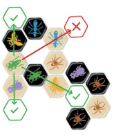

# Hive Board Game AI Documentation

William Reames

This document gives an overview regarding how I implemented Hive within Python and explains how I implemented my AI.

### Table of Contents

1. [Implementing Hive](#hive)
   1. [Keeping Track of the Board](#game_board)
   2. [Performing Actions on the Game Board](#perform_actions)
   3. [Universal Movement Rules](#mvt_rules)
      1. [Freedom of Movement](#freedom_of_mvt)
      2. [The "One Hive" Rule](#one_hive)
   4. [Queen Bees](#queen_bees)
   5. [Ants](#ants)
   6. [Grasshoppers](#grasshoppers)
   7. [Spiders](#spiders)
   8. [Beetles](#beetles)
2. [Implementing the AI](#ai)
   1. [Managing Board States](#board_manager)
   2. [Evaluating a Board State](#eval)
   3. [Minimax](#minimax)
   4. [Speeding up Minimax](#speeding_up_minimax)
      1. [Alpha-Beta Pruning](#alpha-beta)
      2. [Sorting the List of Actions](#sorting)
      3. [Iterative Deepening with Sorted Estimates of Actions](#iterative_deepening)
      4. [Additional Improvements](#additional_improvements)
3. [Conclusion](#conclusion)
4. [Acknowledgments](#acknowledgments)

## Implementing Hive

### Keeping Track of the Board

The first challenge I came across was determining a way to implement the hexagon-based game board within Python. The solution I ended up implementing was to give each hexagon a coordinate, and store it as if it were on a regular 2D plane. 

This image shows how each hexagon can be given a specific coordinate on a plane:

This image shows how each Piece would be stored within my Python implementation. In this case, the Piece would be located at (0, 0), and the displayed coordinates surrounding it would be the six sides of that piece:

Furthermore, I also implemented both Pieces and EmptySpaces. The EmptySpaces were extremely important in simplifying my implementation. EmptySpaces allowed me to more easily understand where players could place new Pieces along with knowing where Pieces could be moved.

As for storing this information, I stored each space object into a dictionary that related the coordinate of the space to the object at that location. This was also separated into two dictionaries: one for Pieces, and one for EmptySpaces. This allowed easy access to a space object if its location is already known. For example, each space contains sets of the surrounding Pieces and surrounding EmptySpaces. This way each space has easy access to all of its surrounding locations. This diagram helps display the class structure used to implement the game:

### Performing Actions on the Game Board

There are two different actions a player can perform on a given turn: placing pieces or moving pieces. To implement this, each Piece was given two important functions: `set_location_to(new_location)` and `remove()`. In order to place a Piece, a new Piece object would be created, then its `set_location_to(new_location)` function would be called. Moreover, if a player would like to move a piece, the Piece would call its `remove()` function, followed by its `set_location_to(new_location)` function. 

To determine where a player could place new Pieces, each EmptySpace on the board would keep track of the number of connected white Pieces and the number of connected black Pieces. Therefore, if an EmptySpace was only connected to white Pieces, white could place a new Piece there. On the other hand, if an EmptySpace was only connected to black pieces, black could place a new Piece there.

As for determining where Pieces could be moved, each Piece had its own `calc_possible_moves()` function, which could be called to updated its set of possible moves listed within the HiveGameBoard. This function was implemented within each of the Piece subclasses.

### Universal Movement Rules

There are two movement rules within Hive that apply to all Pieces on the board: freedom of movement and the "one hive" rule. 

#### Freedom of Movement

The freedom of movement rule states that pieces must slide on the board rather than be picked up off of it (although this does not apply to Grasshoppers or Beetles since they jump on or hop over Pieces). The following images help demonstrate this rule:

To implement this, I kept track of certain "sliding rules". Whenever a Piece was set to a new location (whether by being placed as a new piece or by moving to that location), it would check if other Pieces exist in certain locations. If it found a Piece at any of these locations, the spaces in between the two Pieces would be marked as unable to slide to each other. Then, if either of these Pieces are removed later in the game, the two spaces between them are updated so that they are marked as being able to slide to each other again. The sequence of images below help show how this works. Note, though, that these images are meant to demonstrate this rule specifically, and do not display all the Pieces or EmptySpaces that would usually be found on a game board:

 \
1: A subset of a board state containing two Pieces and one EmptySpace

 \
2: A new Piece is placed

 \
3: The new Piece finds another Piece in one of the specified locations

 \
4: The two spaces between those Pieces are marked as not being able to slide to each other

 \
5: A Piece that was preventing sliding between two pieces was removed

 \
6: The two spaces between those Pieces are marked as being able to slide to each other again

#### The "One Hive" Rule

The "one hive" rule states that all Pieces must be connected to each other at all times. For example, in the below image, the black Ant is unable to move, since doing so would split the hive into two separate groups:

To implement this, each Piece contained a `can_move` boolean value. If this rule would prevent a Piece from moving, this value was set to False. Otherwise, the `can_move` value would be set to True.

There were two methods that I used to determine whether a Piece could move. Firstly, if a Piece (a) was placed with only one connection to another Piece (b), the connected Piece (b) would be locked based on this rule. This is because the connected Piece (b) is the only connection the new Piece (a) has to the rest of the Hive. However, the inverse of this rule is not true. For example, the black Piece in the image below is only connected to one Piece. If the black piece were removed, the Piece it was connected to would still need to be locked based on the "one hive" rule.

Beyond the one simplification of locking Pieces if a new piece is placed with one connected Piece, the rest of the "one hive" rule was implemented through the use of a graphing algorithm. In this case, I treated every Piece as a node in a graph with the connections on each side of the Piece being edges. Then, I searched for articulation points, or any points that would disconnect the graph if they were removed through the use of Tarjan's algorithm. After determining which Pieces were articulation points, I set each Piece's `can_move` value accordingly. More information about Tarjan's algorithm can be found [here](https://www.geeksforgeeks.org/tarjan-algorithm-find-strongly-connected-components/).

### Queen Bees

The Queen Bees have one of the simplest movement rules in the game. The prerequisites for implementing the Queen Bee were to implement the freedom of movement rule as described previously, and implement a way to determine which EmptySpaces Pieces were allowed to move to. In order for a Piece to move on the board, it would need to slide along the edge of another Piece. This meant that there would be cases where a Piece could have EmptySpaces connected to it that it could not move to. This was implemented via a `update_cannot_move_to()` function, which stored its results into a set named `cannot_move_to`. Upon completing these two rules, the Queen Bee's movement was difference between the EmptySpaces and the spaces residing within `self.sliding_prevented_to` and `self.cannot_move_to`.

### Ants

The Ants are a very interesting Piece as they are able to move to *any* space on the board that they are able to slide into. To accomplish this, Ants were actually given the entire set of EmptySpaces as their set of possible moves by default. Although, if any new sliding preventions were discovered because of the freedom of movement rule, EmptySpaces would be added to what I called `ant_prevention_sets`. This would allow for groups on enclosed EmptySpaces to be marked as locations an Ant cannot move to. However, if the Ant could move to an EmptySpace within one of the `ant_prevention_sets` through the set of moves it would have as a Queen Bee (the set of moves one space in any direction), it would also have access to all EmptySpaces within that specific set.

### Grasshoppers

The movement rules for Grasshoppers allow them to jump over a connected line of Pieces. Whenever a Grasshopper is placed on the game board, it traverses across the board in the direction of its connected Pieces. Whenever a path discovers an EmptySpace, that space is added as a possible move for the Grasshopper. Furthermore, as the Grasshopper is forming paths and passing through other Pieces, each Piece is marked as being on the path of that Grasshopper. This way if a Piece on the path is removed, the new EmptySpace that will be replacing that Piece will be added as a new move, and the rest of the path beyond that location will be removed. Moreover, if a Piece is placed on an EmptySpace that was marked as a possible move for a Grasshopper, that possible move is removed and the path continues its traversal in the direction of the Grasshopper's movement.

### Spiders

The implementation for Spider movement was very similar to the Grasshopper's. Rather than traverse across a line of Pieces, the Spider traverses across a sequence of EmptySpaces. In this case, a path for a Spider would move through EmptySpaces by traveling to each space within the set of moves it would have if it were a Queen Bee (moving one space at a time). Then, once the path reaches a distance of three spaces from the Spider, a possible move is added. Furthermore, in a similar fashion to the Grasshopper, if any EmptySpace that was marked as being on a path for a Spider is removed or movement rule is updated, the path will be updated accordingly.

### Beetles

The Beetle's movement is the same as the Queen Bee's, except it is also able to move on top of other Pieces. In this case, the Beetle's set of possible moves was the set of EmptySpaces it could move, combined with the set of Pieces surrounding it. The Beetle was not limited by its `sliding_prevented_to` set, since it can be picked up to move to other spaces. Additionally, if the Beetle is on top of a piece, it is also not limited by the "one hive" rule, since its previous location would be filled by the piece it was on top of. 

To accommodate being able to move on and off of other Pieces, additional functionality needed to be added to the Beetle's `set_location_to(new_location)` and `remove()` functions. If the Beetle is not moving on or off of another Piece, it calls the functions normally. On the other hand, if the Beetle is being placed onto another Piece, it copies that Piece's information (connected Pieces, connected EmptySpaces, movement limitations, etc.); stores the object of that Piece; replaces the Piece within the HiveGameBoard; and updates the surrounding EmptySpaces' counts of white/black pieces. If the Beetle is moving off of another Piece, it copies its information back to the stacked Piece; updates the surrounding EmptySpaces' counts of white/black pieces; and adds the stacked Piece back into the HiveGameBoard.

## Implementing the AI

### Managing Board States

There were two primary components that were required of my implementation before I could begin working on my AI. These were: being able to output a list of possible moves on a given turn, and being able to search through future board states. It was fairly simple to output a list of possible moves after implementing the various movement rules for each of the Pieces. However, none of the above descriptions of my implementation details searching through future board states. To be able to do this, I created a class called the `BoardManager`. 

The `BoardManager` uses a Singleton design pattern and contains a single `HiveGameBoard` instance within it. The class has two important functions: `get_successor(action)` and `get_predecessor()`. These are what the AI uses to search future board states. When the `get_successor(action)` function is called, that action is performed on the HiveGameBoard, and the action is added to a stack. Later, when the `get_predecessor()` function is called, the action at the top of the stack is popped off, and the board manager calls the HiveGameBoard's `undo_action(action)` function. This returns the board to the state that existed before the previous `get_successor(action)` call. In order to return to the original board state, the board manager can undo all actions stored within the stack.

### Evaluating a Board State

In order for the AI to decide what a good or bad move would look like, it needs a way to evaluate the board. To do this, the `HiveGameBoard` class contains a `evaluate_state()` function. This function uses information about the current state of the game board, and outputs a number estimating which player is winning and by how much. A positive number indicates that white is winning, while a negative number indicates that black is winning. The following table displays aspects of the game board that the evaluation function accounts for:

| Value         | Utility                                                                                                                                                                    |
|---------------|----------------------------------------------------------------------------------------------------------------------------------------------------------------------------|
| Really good!  | - Allied Pieces around the Opponent's Queen Bee   - Beetles on top of the Opponent's Queen Bee   - Enemy Pieces around the Opponent's Queen Bee that *cannot* move |
| Good          | - Enemy Pieces around the Opponent's Queen Bee that *can* move   - Allied Pieces that are able to move next to the Opponent's Queen Bee                                |
| Bad           | - Allied Pieces that are *not* able to move to the Opponent's Queen Bee                                                                                                    |
| Really Bad    | - Pieces that cannot move at all                                                                                                                                           |

In addition, all of these values can be inverted when swapping the two players. For example, Opponent's Pieces around the Allied Queen Bee would be really bad! More details regarding the exact values for each of these utilities can be found within the `evaluate_state()` function in `HiveGameBoard`

### Minimax

The goal of the minimax AI is to maximize its chance of success, while accounting for its opponent minimizing its chance of success. This AI will search through all of its possible moves, along with each of its opponent's responses to those moves, then all the moves it could perform after its opponent's responses, then another set of its opponent's responses, and so on. This continues until the AI either reaches a predefined maximum depth (or in this case, a certain number of turns in the future), or an end-state (a win, loss, or draw). The AI will then use these values to determine the best possible sequence of moves.

To determine the best possible sequence of moves, the AI takes the evaluations it found, then calculates which would be the best move for its opponent (the minimax algorithm I implemented always ends with an opponent's move). Next, it would compare the opponent's best responses its opponent would have after each of the actions available to the AI. The AI would then choose the best final state out of those responses. The image below (taken from [wikipedia](https://en.wikipedia.org/wiki/Minimax)) can help display how this algorithm works. In this case, the AI would be using the maximizing function, and would be simulating its opponents moves using the minimizing function:

### Speeding up Minimax

Although the minimax algorithm can be fairly good at determining the best course of action if it is given enough depth and a good evaluation function, it can also take an extremely long time if no adjustments are made. The end result of my minimax AI was able to search 2 full turns in the future (4 actions) in an average of 20 seconds. To do this, it searched through approximately 250,000 actions. If I had not made any adjustments, it would instead search through tens of millions of actions[^num_actions]. Because of this, it is fairly clear how important it is to improve minimax beyond its default implementation.

[^num_actions]: There are an average of 28 turns per game, and an average of 40 moves per turn. If every action was checked 2 full turns in the future (depth of 4), the AI would need to check 28/2 * (40^0 + 40^1 + 40^2 + 40^3 + 40^4) = 36,758,974

#### Alpha-Beta Pruning

Alpha-beta pruning is an extremely common approach to speeding up minimax. It uses mathematical logic to prune off branches that do not need to be checked. For example, a minimax AI could have processed part of the decision tree, and found that performing action (a) will eventually lead to a value of 9. The AI is in the middle of processing action (b), and found that one of its opponent's responses will lead it to a state of -1. Because its opponent will always want to minimize its chance of success, the opponent will only play a move that would lead to a value ≤-1. And since the AI has already found a move (a) that is better than -1, it can ignore the rest of that branch (b). The image below helps demonstrate this concept:

#### Sorting the List of Actions

One of the ways to further improve alpha-beta pruning is to sort the list of actions. If the algorithm can find the best possible move first, it will be able to prune significantly more branches. To help with this, I sorted the actions so that all move actions were processed before placement actions. This is because it is often better to use the pieces you already have on the board rather than place new ones. Furthermore, it looked at its possible moves in the order of the following pieces: Queen Bees, Spiders, Grasshoppers, Beetles, and Ants. Although, the ordering in which different types of pieces was more so that pieces with fewer actions or faster processing times would be processed sooner. For example, although moving an Ant can often be the best move, it is processed last in that sequence since Ants have significantly more moves than any other piece and take a while to process.

#### Iterative Deepening with Sorted Estimates of Actions

Because the minimax AI can sometimes take a very long time to process actions (if I let it look three full turns in the future, it can take up to an hour in some cases), I wanted to set a time limit to make sure the player would not be waiting for an eternity before the AI plays a move. To do this, I used something called iterative deepening. This means that I would iteratively increase the depth the AI would search using minimax. It would start by searching one full turn in the future, then two full turns, then three, and so on. At some point during this process, the AI may run out of time, and then it will return the best move it was able to find during that timeframe.

An interesting thing about iterative deepening is that although it may sound counter-intuitive to completely redo a run of minimax for each iteration, it actually speeds up the process. Because adding a single extra layer of depth would increase the time minimax takes exponentially, all the previous layers will be a very small fraction of the total time. So even though it is recalculating a lot of information, it does not increase the total time by a significant amount.

Furthermore, the AI I implemented is also able to record estimates of good/bad actions for a given board state while it progresses through the minimax algorithm. For example, say that the AI processed a depth of 1, and found that action (a) had a value of -10, action (b) had a value of 18, and action (c) had a value of 7. When the AI goes to process a depth of 2, it will be able to recognize that it has seen that state before, and will process actions in the order of (b), then (c), then (a). This means that the alpha-beta pruning algorithm should find the best action closer to the beginning of the list, therefore allowing it to prune off significantly more branches.

#### Additional Improvements

There were a couple additional improvements that I added to speed up my minimax algorithm. For starters, if the AI ever found a winning move, it would immediately play it without any further thought. This is because you cannot play anything better than a winning move, and there is no point to continue searching if you found a way to win. 

Moreover, if the AI ever found a state where there were 5 pieces around its opponent's Queen Bee, it would check if it had any free pieces with the ability to move to the last location surrounding the Queen Bee. This was a lot faster than checking every possible move since it would only need to check if any of its pieces can move to a single specific location. Additionally, this function would be run even if the AI had reached its maximum depth. This allowed it to effectively search an extra action further during the endgame.

## Conclusion

While working on this project, I was able to implement the board game, *Hive*, within Python, and created an AI that can play it. My implementation can keep track of all board information, including piece locations, possible moves, possible locations to place pieces, and how many pieces each player has left in their reserve. I was able to create an evaluation function to use along with a minimax AI to allow the AI to perform intelligent moves. Furthermore, I used alpha-beta pruning, sorted action lists, iterative deepening, and stored estimates of good/bad moves to speed up my minimax algorithm. The AI seems to be performing fairly well, and takes an average of 20 seconds with a maximum of 1-2 minutes when searching 2 full turns in the future. 

However, there are still a few aspect of my AI that could be improved. Firstly, its endgame could be improved significantly. If the AI ever discovers that its opponent has a sequence of moves guaranteeing that it will win, the AI will give up and perform moves at random without any logic behind them. This is because it registers all moves as being equally bad, and does not know which action would be best. Secondly, there is still much that could be done to speed up my AI. This could involve either improving the algorithm, or more likely, making my implementation of Hive more efficient. Lastly, I created my evaluation function using a guess-and-check system, and many of the values may not be optimal. It could be beneficial to use a reinforcement learning algorithm to help the AI learn which aspects of the evaluation function it should value the most in order to have the best chance of success.

Overall, though, I would say that I am fairly happy with how my project turned out :). I was able to successfully create a seemingly intelligent AI through the use of a minimax algorithm. The AI is able to beat me when searching two full turns in the future, and even when I am able to win, I still enjoy playing against it and find it challenging. This was exactly what I was hoping for when I started working on this project, and I am happy with the final product.

## Acknowledgments
- One of my best friends, [Charles Steelberg](https://www.linkedin.com/in/charles-steelberg-746177213/), helped me think of a majority of the methods I used to speed up my minimax implementation
- My implementation for Tarjan's algorithm was based off of https://www.geeksforgeeks.org/tarjan-algorithm-find-strongly-connected-components/
- The method I used to output the board state to the terminal in a hexagon grid was based off of https://inventwithpython.com/bigbookpython/project35.html